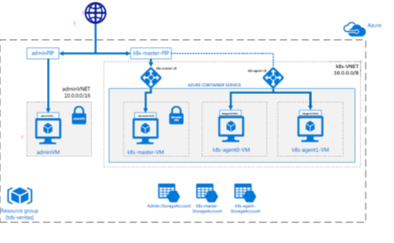

# compute-engine-akka

An implementation of [compute-engine](https://github.com/amolthacker/compute-engine) using 
[Akka Cluster](http://doc.akka.io/docs/akka/current/common/cluster.html) and 
[Akka HTTP](http://doc.akka.io/docs/akka-http/current/scala.html) in a Docker containerized runtime orchestrated with 
[Kubernetes](https://kubernetes.io/)

It uses a pair of seed nodes as the `controller` which:
 * Act as contact points for the `valengine` worker nodes to join the cluster
 * Expose RESTful service for job submission from an HTTP client
 * Dispatch jobs to the registered `valengine` workers
 
The `valengine` workers process individual or batch (job) valuation requests from the `controller` nodes by doing static 
pricing compute using the [mockvalengine](https://github.com/amolthacker/azure-poc-compute-engine-mock)

## Architecture




## Running the application

### Pre-requisites

 * Docker runtime
 * Kubernetes cluster or [Minikube](https://kubernetes.io/docs/getting-started-guides/minikube/)
 
### Build

 1. Get the project from GitHub
 ```
 $ git clone https://github.com/amolthacker/azure-poc-compute-engine-acs-akka.git
 $ cd compute-engine-akka
 ```
 
#### With Docker
 
  * Update the Docker image name/tag to as desired in the pom
  ```
  <configuration>
    <imageName>amolthacker/azure-poc-compute-engine-acs-akka:latest</imageName>
  </configuration>  
  ```
  
  * Build
  ```
  $ mvn clean package
  ```
  This will build the project and its Docker image and push the image onto [DockerHub](https://hub.docker.com/r/amolthacker/azure-poc-compute-engine-acs-akka/)
 
#### Without Docker 
 
  * Build
  ```
  $ mvn clean package -DskipDocker
  ```
  You can then build the Docker image from within `docker-machine` and push to repository (DockerHub by default)
  ```
  $ docker-machine start default
  $ docker-machine ssh default
 
  docker@default:~$ cd <proj-dir>
  docker@default:~$ docker build -t <image-name>[:tag] .
  docker@default:~$ push <image-name>[:tag]
  ```
 
### Deployment

 1. Update Docker image details in `k8s/ve.yaml` and `k8s/ve-ctrl.yaml`
 
 2. Start the Kubernetes cluster
    OR
    Minikube
    ```
    $ minikube start
    ```
 
 3. Deploy the Service
    ```
    $ kubectl apply -f k8s/ve-svc.yaml
    ```
    
 4. Deploy the `controller` seed nodes
    ```
    $ kubectl apply -f k8s/ve-ctrl.yaml
    ```
    
 5. Deploy the `valengine` worker nodes
    ```
    $ kubectl apply -f k8s/ve.yaml
    ```  

### Exposing the `controller` service

 1. To expose the `controller` HTTP Service with External IP
    * Using NodePort
      ```
      $ kubectl expose service ve-ctrl --type=NodePort --name=ve-ctrl-exp
      ```
    * Using Load Balancer
      ```
      $ kubectl expose service ve-ctrl --type=LoadBalancer --name=ve-ctrl-ext
      ```  

### Job Submissions

 * Minikube
 
   Get service url
   ```
   $ minikube service ve-ctrl-exp --url
   ```
   Submit Job
   ```
   $ curl -X GET '<service-url>/valQuery?metric=<NPV|FwdRate|OptionPV>&numTrades=<numTrades>'
   
   eg:
   $ curl -X GET 'http://192.168.99.101:34567/valQuery?metric=NPV&numTrades=20'
   ```

### Scaling

 1. To scale the `valengine` workers
    ```
    $ kubectl scale --replicas=4 deployment/ve
    ```
### Tear Down

 ```
 $ kubectl delete -f k8s/
 $ minikube stop
 ```
 
### Deployment in ACS

 ```
 see acs-k8s/acs-k8s-provision.sh
 ```

### Job Submission in ACS

 ```
 $ ssh -i ~/.ssh/az -L 8001:localhost:8001 vtasadmin@tdsveritas.northcentralus.cloudapp.azure.com
 $ vtasadmin@k8s-master-29533770-0:~$ kubetail ve
  
 $ ./bin/submit-compute-batch -n 10 -s tds-veritas-akka.northcentralus.cloudapp.azure.com
 ```
 
## Next

 * Update Deployment with autoscale settings
 * Use [kryo](https://github.com/EsotericSoftware/kryo) serialization
 * Job state management